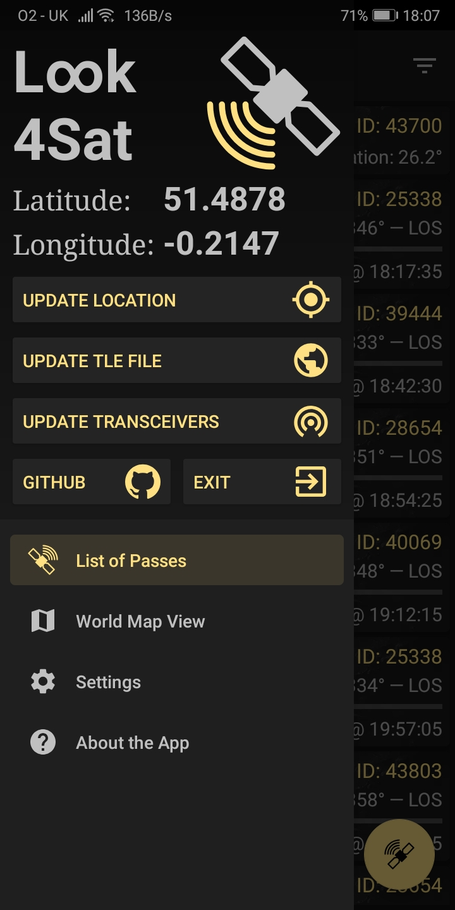
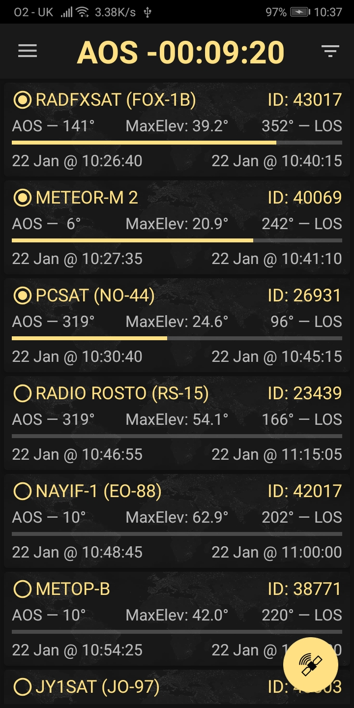
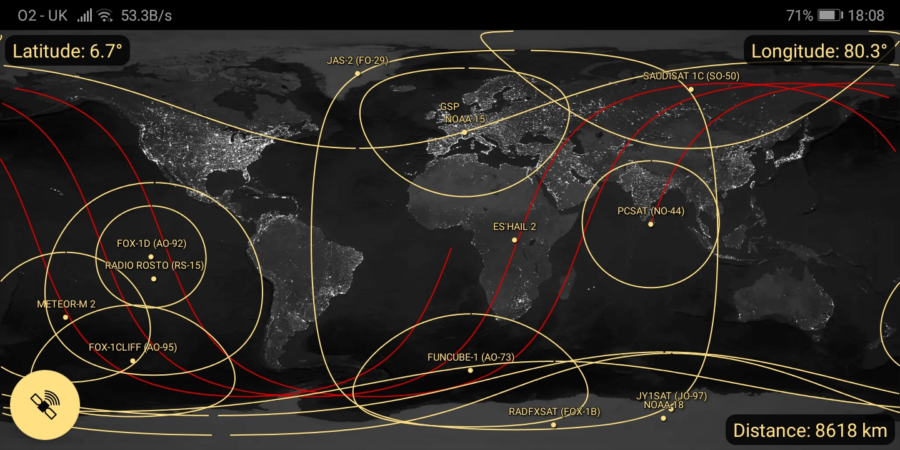

# Look4Sat: Radio satellite tracker
Amateur radio and weather satellite tracker and passes predictor for Android.

The very app creation and design is hugely inspired by the open-source [Gpredict](http://gpredict.oz9aec.net/) desktop satellite tracking application, created by [Alexandru Csete, OZ9AEC](https://github.com/csete) and contributors, supported by the [Libre Space Foundation](https://libre.space/).

The [Libre Space Foundation](https://libre.space/) team is also behind the epic [SatNOGS](https://satnogs.org/) project that provides an extremely easy to use [API](https://db.satnogs.org/api/) and [DB](https://db.satnogs.org/) with a huge amount of information about satellites, their telemetry and transmitters, which the app uses under the hood.

For TLE data calculation and passes prediction Look4Sat uses the mavenized version of [predict4java](https://github.com/davidmoten/predict4java) library, created by [David A. B. Johnson, G4DPZ](https://github.com/g4dpz) and [Dave Moten](https://github.com/davidmoten). Thank you guys for your hard work making this lib efficient and easy to use!

The app is built using Dagger2, Retrofit2, Kotlin and Kotlin coroutines, Architecture Components and Jetpack Navigation.

## Main features: 

– Calculating satellite passes for up to one week (168 hours)  
– Calculating passes for the current or manually entered location  
– Showing the list of currently active and upcoming satellite passes  
– Showing the active pass progress, polar trajectory and transceivers info  
– Showing the satellite positional data, footprint and ground track on a map  
– Offline first: all the passes predictions are made offline. It's up to you to decide when  
to update the TLE file and the transceivers DB. (Updates once a week are recommended)
